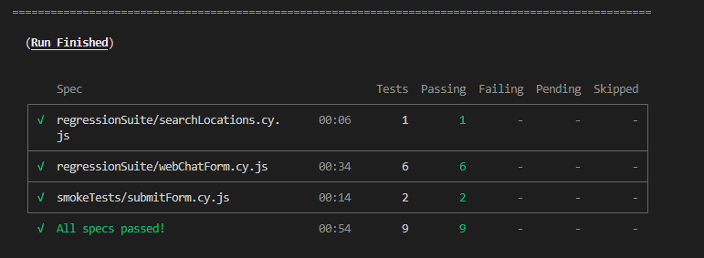

# Webchat widget automation

***
- [Local Setup](#local-setup)
- [Summary](#summary)
- [Test structure and files](#test-structure-and-files)
- [Running the tests](#running-the-tests)
- [Idendifyied potential bugs](#idendifyied-potential-bugs)
***

## Local Setup
- prerequisites: node is installed
- clone this repository to a local machine
- open the terminal in the root directory of the repository and run `npm install`

## Summary
This automation suite uses Cypress with JavaScript and covers some of the expected
functionality of the Webchat widget. The majority of the test cases are added in the
`webChatForm.cy.js` file, with a few additional flows covered in two other files.

Note: since there are almost no requirements as to the content, input fields behavior, etc.,
all the tests were created based on the assumptions about those requirements. Therefore, no
test cases were added for the accepted characters for specific fields, limit of characters
that can be entered in a field, and so on.

Also this is not a complete set of test cases for this widget, but rather a presentation of
how the tests can be set up and organized, and how verification can be done to make sure the
actual behavior of the application matches the expected results.

## Test structure and files
1. The `smokeTests` folder is intended for a quick sanity check that the main flow of the
widget works, without getting into the detailed testing of every scenario and component.
There is currently one file in there called `submitForm.cy.js` which covers two test cases:
- User proceeds to the message form, and once all the required fields are filled out, the
verificaiton is that Send button is enabled (per requirements the actual submitting of the
form is not being verified).
- User proceeds to the message form, but without filling out the Message field, the Send
button remains disabled.

2. The `regressionSuite` folder is supposed to include a complete set of test cases to verify
all the parts and flows of the application. Currently it includes two files:
- `searchLocations.cy.js` test case checks the Select Location modal.
* Note: the assignment description mentions that there are 4 locations available, however,
actual number of locations is 3, so the test case verifies for 3 locations being populated.
- `webChatForm.cy.js` test the appearance and functionality of the WebChat form.

## Running the tests
- using the terminal, to run all the tests headlessly, execute:
`npx cypress run` or `npm run cy:run`
- to run only the smoke tests headlessly execute:
`npm run cy:smoke`
- to run a specific file or folder, use `npx cypress run` or `npm run cy:run` and provide the
path to that file, for example:
`npx cypress run --spec "cypress/e2e/smokeTests/submitForm.cy.js"`
- to open the Cypress runner and execute tests from the UI use:
`npx cypress open` or `npm run cy:open`

When running all tests using CLI, the expected output looks as follows:

## Idendifyied potential bugs
- the back arrow button doesn't take the user to Search Locations (this is reproduced manually,
but for some reason when automation runs it passes)
- most fields accept unlimited number of characters
- name field accepts special characters and numbers
- date in the intro message is hardcoded
